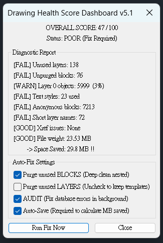

[中文版](README_ZH.md) | **English**

---

# DrawingHealthScore.lsp — DWG Health Diagnostic Tool

**One command. Scan your drawing. Get a score out of 100 — and fix it in one click.**

---

## The Problem

When you receive a drawing from a consultant, or before you submit your own — do you actually know how clean it is?

```
Receive drawing from contractor
→ Messy layers, unpurged blocks, objects on Layer 0
→ File keeps getting larger, slower, unstable
→ No idea what's wrong or what to fix first
→ Run PURGE once, not sure if it did anything
```

AutoCAD's built-in AUDIT and PURGE are single-point fixes. Nobody has ever put a score on the whole thing. You can't answer: *how healthy is this drawing?*

---

## The Solution

Type `DHS`. A diagnostic dashboard pops up:

- **Overall score 0–100** — know the health of a drawing instantly
- **8 individual checks** — see exactly what's wrong and how bad it is
- **Check the fixes you want, click Run Fix Now** — runs silently in the background
- **Auto re-scans after fixing** — shows exactly how many MB were saved

```



```

---

## Installation

1. Download `DrawingHealthScore.lsp`
2. In AutoCAD, type `APPLOAD`
3. Load the file
4. Type `DHS` to run

**Tip:** Add it to AutoCAD's Startup Suite for automatic loading every session.

---

## How to Use

Type `DHS`. The dashboard opens automatically after scanning.

The window shows:

- **Top:** Overall score and status
- **Middle:** 8 diagnostic results with [GOOD] / [WARN] / [FAIL] labels
- **Bottom:** Fix options with checkboxes — click **Run Fix Now** to execute

After fixing, the tool re-scans automatically and shows before/after comparison with MB saved.

---

## Commands

| Command | Description |
|---------|-------------|
| `DHS` | Scan drawing and open dashboard |
| `DHSFIX` | Same as DHS |
| `DHSF` | Same as DHS |

---

## Score Breakdown (8 checks, 10 points each)

| Check | Warn | Fail |
|-------|------|------|
| Unused layers | > 10 | > 30 |
| Unpurged blocks | > 20 | > 50 |
| Layer 0 objects | > 1% of total | > 5% of total |
| Text styles | > 5 | > 10 |
| Anonymous blocks | > 200 | > 500 |
| Short layer names | > 10 | > 20 |
| Xref status | — | any unresolved |
| File weight | > 3 KB/obj | > 6 KB/obj |

---

## Fix Options

| Option | Details |
|--------|---------|
| Purge unused BLOCKS | Runs `-PURGE B` 3 times — deep nested clean |
| Purge unused LAYERS | Runs `-PURGE LA` 3 times — uncheck to preserve template layers |
| AUDIT | Fixes drawing database errors silently in background |
| Auto-Save | Sets `ISAVEPERCENT=0` before saving to force full rewrite and maximum file size reduction |

**Settings are remembered** between runs — your checkbox choices persist for the session.

---

## Compatibility

| AutoCAD Version | Status |
|----------------|--------|
| 2014 and above | ✅ Supported |
| Below 2014 | Not tested |

Also works with BricsCAD, GstarCAD, and other AutoLISP-compatible CAD platforms.

---

## Version History

| Version | Notes |
|---------|-------|
| v5.1 | Absolute path fix for file size detection, `ISAVEPERCENT=0` for maximum space savings, split PURGE into Blocks / Layers, settings memory across runs |
| v4.2 | Unified dashboard — diagnostics + fix in one window, MB savings display |
| v3.0 | Dynamic DCL generation, independent fix checkboxes |
| v1.0 | Command-line output version |

---

## Support This Project

If DrawingHealthScore helped you catch a problem or trim down a bloated file, consider buying me a coffee ☕

[](https://ko-fi.com/beastt1992)

---

## License

MIT License — Free to use, modify, and distribute.

---

**Made for architects who want to know: how healthy is this drawing?**
